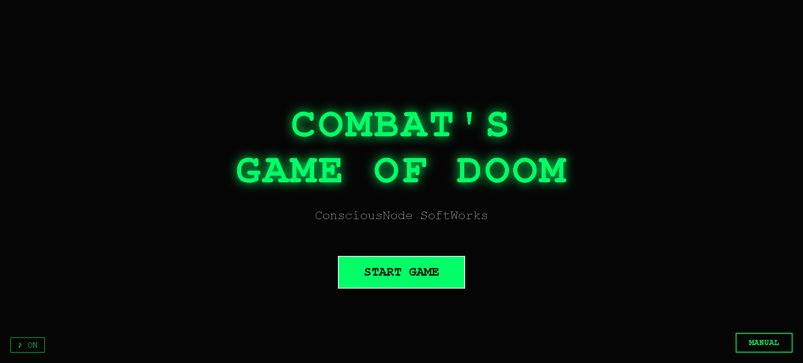
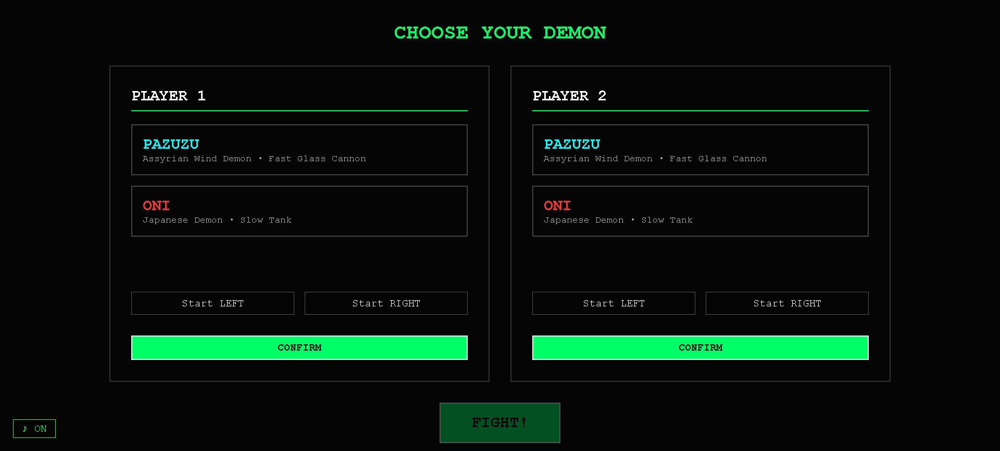
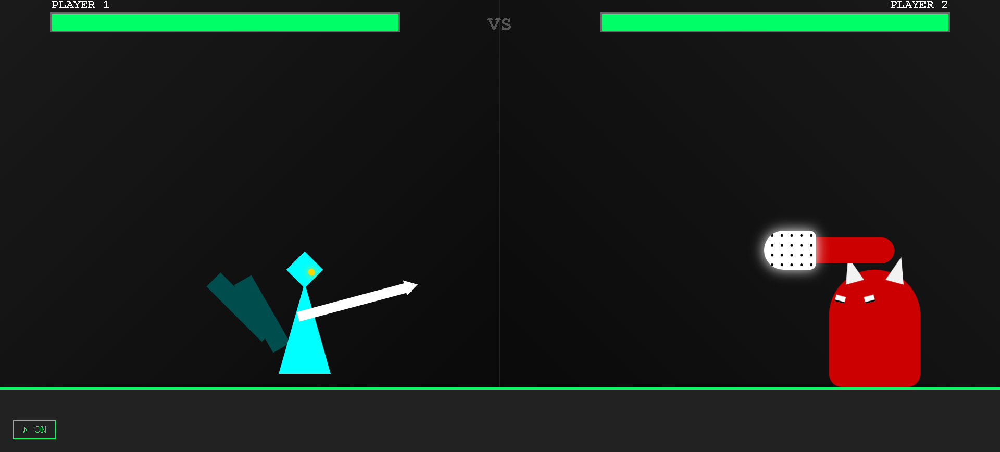
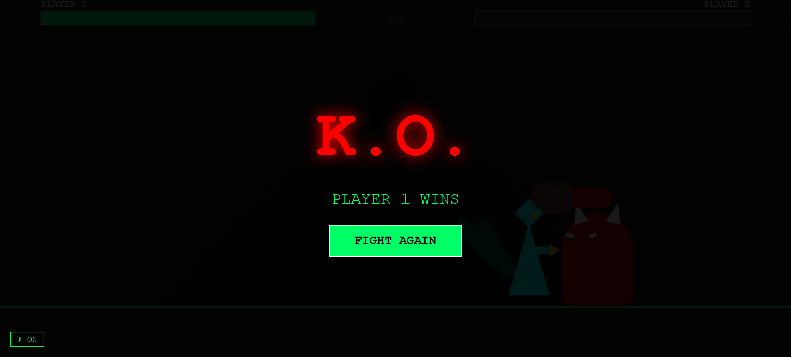

# Combat's Game of Doom


> *A fighting game where the game engine is CSS. Not assisted by CSS. Not styled with CSS. CSS IS the engine.*

**ConsciousNode SoftWorks** — computational folk art

---






---

## What Is This

Combat's Game of Doom is a 2-player local fighting game built as a single HTML file with zero external dependencies. No images. No libraries. No server. Open it in a browser and fight.

The unusual thing: **CSS is the engine.** Hit detection, health tracking, state management, game logic — all of it runs in CSS selectors. JavaScript's only job is to translate keypresses into checkbox states. Everything else is `:has()`.

This is computational folk art. A single file you can open from a USB drive with no internet, read in a text editor, and modify with nothing but a browser.

---

## Architecture

The core insight is the **independent layer system**, inspired by raycasting renderers. Each fighter lives on their own full-screen absolute layer. Visual overlap between fighters is not collision — it's just two layers occupying the same space. This solves the fundamental problem that plagued early attempts at CSS-based fighting games: coordinate systems that could never actually meet.

```
Layer P1 (z-index: 50)  ─── Fighter 1 traverses 0-80vw
Layer P2 (z-index: 49)  ─── Fighter 2 traverses 0-80vw
                              ↑
                    Overlap is visual illusion.
                    Hit detection is JS proximity check
                    on two independent float values.
```

**State machine via checkboxes:**

The entire game state lives in hidden `<input type="checkbox">` elements. CSS `:has()` selectors read this state and react — showing screens, animating fighters, rendering health bars, triggering the KO screen. The browser's style recalculation engine is the game loop.

```
checkbox checked  →  :root:has(#p1-jump:checked) #p1 { transform: translateY(-220px) }
checkbox unchecked →  transform removed, fighter lands
```

**JS role — keyboard adapter only:**

```javascript
// JS does exactly one thing: translate keypresses to checkbox states
document.addEventListener('keydown', e => {
    cb(keys[e.key]).checked = true;
});
```

Hit detection, damage calculation, and health tier progression happen in JS because they require arithmetic — but the *result* of every calculation is written back as a checkbox state, which CSS then reads and renders.

---

## Fighters

<!-- SCREENSHOT: Arena with both fighters -->
<!-- Add: screenshots/arena.png -->

### PAZUZU — Assyrian Wind Demon
*Fast Glass Cannon*

The ancient wind demon fights with reach and speed. Light attacks are quick but glance off Oni's armor. Heavy attacks hit hard but leave Pazuzu exposed — against Oni's club, a single heavy hit removes two health tiers.

### ONI — Japanese Demon  
*Slow Tank*

The Oni's natural armor absorbs light attacks from Pazuzu — it takes two light hits to register a single tier of damage. But the Oni's club hits like a freight train. Mirror matches play by standard rules.

**Damage table:**

| Attacker | Defender | Light | Heavy |
|----------|----------|-------|-------|
| Pazuzu | Oni | 1 tier per 2 hits | 1 tier |
| Oni | Pazuzu | 1 tier | 2 tiers |
| Mirror | Mirror | 1 tier | 2 tiers |

---

## Controls

| Action | Player 1 | Player 2 |
|--------|----------|----------|
| Move | A / D | ← / → |
| Jump | W | ↑ |
| Block | S | ↓ |
| Light Attack | F | L |
| Heavy Attack | G | ; |

**Blocking** reduces incoming damage by half. A blocking fighter cannot attack.  
**Jumping** evades all attacks while airborne.  
**Mirror matches** use palette swap — P2's fighter hue-rotates 180°.

---

## Audio

Four procedurally generated tracks via Web Audio API. No audio files. No samples. Pure oscillators and noise buffers synthesized at runtime.

- **Title** — slow ominous arpeggios, 80 BPM, atmospheric sine melody
- **Select** — building tension with drums, 120 BPM
- **Fight** — fast SNES-style combat loop, 160 BPM
- **K.O.** — descending requiem, 60 BPM, reverb-simulated tails

Sound effects: light hit, heavy hit, block clang, jump sweep, land thud, UI blip.

Toggle audio with the **♪ ON / ♪ OFF** button.

---

<!-- SCREENSHOT: Character select screen -->
<!-- Add: screenshots/select.png -->

---

## Running It

```bash
# Clone
git clone https://github.com/ConsciousNode/combats-game-of-doom.git

# Open
open combatgameofdoom.html
# or just drag the file into any modern browser
```

No build step. No npm install. No server. One file.

---

## Extending It

Adding a new fighter requires zero engine changes. The architecture is designed for this:

```css
/* 1. Add fighter art */
.art-newfighter { display: none; ... }
:root:has(#p1-picks-newfighter:checked) #layer-p1 .art-newfighter { display: block; }

/* That's the entire engine integration. */
```

Then add the character select card, the checkbox, and damage rules in `checkHits()`. The engine doesn't know or care.

Full instructions are in the `/* ADDING A NEW FIGHTER */` comment block in the source.

---

## Technical Stack

| Layer | Technology |
|-------|-----------|
| Game Engine | CSS `:has()` selectors |
| State Memory | HTML checkboxes |
| Fighter Rendering | Pure CSS (borders, gradients, transforms) |
| Movement | JS → inline style `left: Nvw` |
| Hit Detection | JS proximity math on two floats |
| Audio | Web Audio API (zero files) |
| Dependencies | None |
| File count | 1 |

---

## Philosophy

This is part of the [ConsciousNode SoftWorks](https://github.com/ConsciousNode) portfolio of computational folk art — software as expressive medium, single-file constraint as formal structure, offline-first, zero dependencies, philosophically coherent.

> "I can't write code. I write intentions, constraints, and philosophy."  
> — ConsciousNode README

---

## License

MIT — see [LICENSE](LICENSE)

---

*ConsciousNode SoftWorks, 2026*
